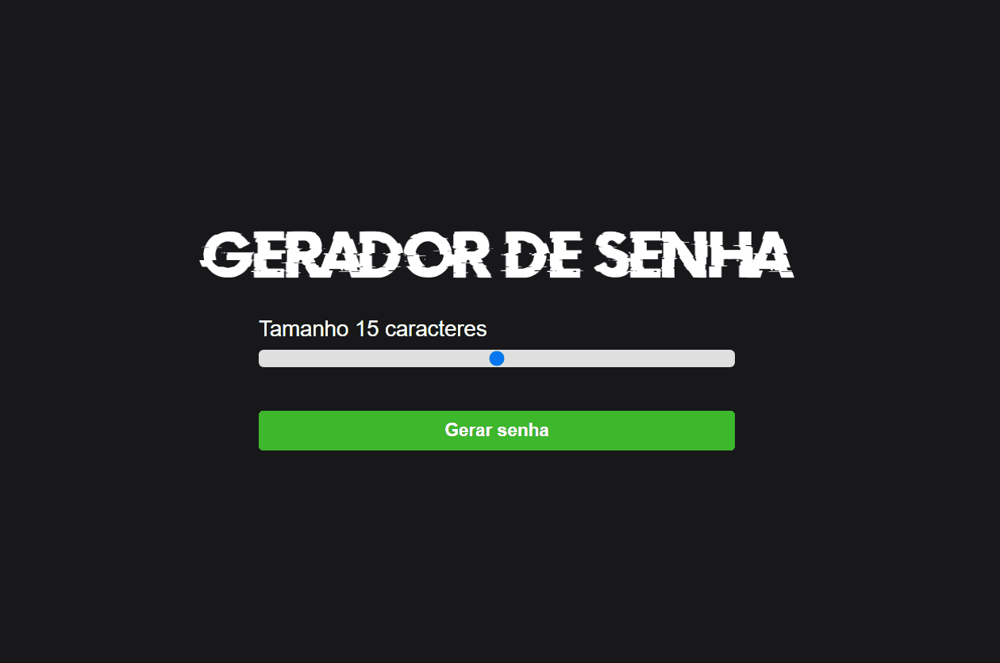

<h1 align="center">Gerador de senha</h1>

O Gerador de Senhas cria senhas aleatórias de qualquer tamanho.

A aleatoriedade das senhas geradas as fazem difíceis de serem adivinhadas.

<h1 align="center">
  
</h1>

---
### Tecnológias

As seguintes ferramentas foram usadas na construção do projeto:

<ul>
    <li>HTML</li>
    <li>CSS</li>
    <li>Javascript</li>
</ul>

---
### Link

  <a href="https://gisellesouzaa.github.io/Gerador-Senha/" target="_blank">Clique aqui</a> para testar o site.

---

### Fontes e sites utilizados durante o projeto

<ul>
    <li><a href="https:https://developer.mozilla.org/en-US/docs/Web/API/GlobalEventHandlers/oninput" target="_blank">.oninput</a>
    <li><a href="https://developer.mozilla.org/pt-BR/docs/Web/JavaScript/Reference/Global_Objects/String/charAt" target="_blank">método charAt</a>
    <li><a href="https://www.w3schools.com/css/css3_transitions.asp" target="_blank">Transições CSS</a>
    <li>Baseado no projeto do canal Sujeito Programador.
</ul>
